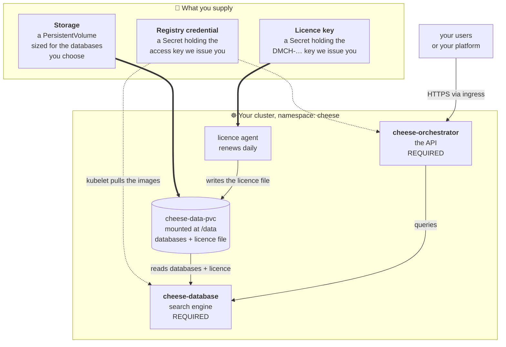

# cheese-k8s

A single Helm chart (`charts/cheese`) that brings up the whole on-prem CHEESE
stack from one `helm install`. Every component is toggled with a top-level
`.enabled` key in **one** `values.yaml` — there are no per-environment overlay
files. The environment (storage class + ingress class) is selected with
`deployment.target`.

## Basic setup <kbd>👤 start here</kbd>

The recommended deployment is two components: **`cheese-database`** (the search
engine) and **`cheese-orchestrator`** (the API you call). Together they are a
complete, working CHEESE — everything else in this chart is optional and off by
default, so a plain `helm install` gives you exactly this.

You supply three things. The chart supplies the rest.



### The three things you supply

| | What | Where it goes | Notes |
|---|---|---|---|
| 💾 | **Storage** | a volume mounted at `/data` — either one you provide (`data.existingClaim`) or one the chart provisions as `cheese-data-pvc` | Holds the databases *and* the licence file. Size it for the databases you pick — they run from under 1 GB to 1.2 TB each, ~5.4 TB for the whole catalogue. Stage the contents owned by `2112:0`. Layout and staging commands: [docs/pvc-data-runbook.md](docs/pvc-data-runbook.md). |
| 🔑 | **Registry credential** | a Secret the kubelet uses to pull the images | One access key from DeepMedChem. It is read-only and its only right is pulling what you are licensed for. |
| 📄 | **Licence key** | a Secret the licence agent reads | A `DMCH-…` key. The agent exchanges it for a 30-day licence file, writes that to `/data`, and renews it daily — so the licence covers the whole cluster and nodes can come and go. |

### Licensing on Kubernetes is v1 only

CHEESE has two licensing schemes. On Kubernetes only one of them applies:

- **v1 — "call home"** (what you use): the agent renews a 30-day file daily and
  the licence authorises **the whole installation**, however many nodes it spans.
- **v0 — "air-gapped"**: a long-lived file bound to **one physical machine's
  hardware id**. It cannot work on a cluster whose nodes change, so it is offered
  only for single-host Docker Compose installs.

> **⚠️ Status, so nobody is misled.** **No released product image verifies a v1
> licence yet** — that port is open work in the four gated repos. Until it ships,
> a v1 key is issued but not enforced, and a v1 licence *file* handed to a current
> image will be rejected by its v0 verifier with a misleading
> "signature does not match". Talk to us before wiring licensing into a partner
> cluster.

### Install it

```bash
helm install cheese charts/cheese -n cheese --create-namespace \
  -f charts/cheese/values-secrets.yaml
```

No `--set *.enabled` flags needed — database and orchestrator are the defaults.
Add components later by turning them on (see [Profiles](#profiles)). Full
step-by-step, including the secrets, is in [Quick start](#quick-start) below.

---

## Components

| Component | Key | Default | Notes |
|---|---|---|---|
| **Database** (app / jobs-db / jobs-exec / download-exec / **file-server**) | `database.enabled` | **on, required** | search engine + result file server, all off one image |
| **Orchestrator** | `orchestrator.enabled` | **on, required** | the API you call |
| Search UI | `searchUi.enabled` | off | public frontend |
| SynthonGPT | `synthongpt.enabled` | off | synthon model server |
| **Ketcher** | `ketcher.enabled` | off | self-hosted molecule editor (UI iframes it) |
| **Electrostatics** | `electrostatics.enabled` | off | electrostatics inference; UI degrades gracefully if absent |
| **Alignment** | `alignment.enabled` | off | conformer alignment, license-gated |
| **Supabase** | `supabase.enabled` | off | in-cluster auth + per-user spaces (test profile) |
| **oauth2-proxy** | `oauth2Proxy.enabled` | off | SSO stub (alternate to Supabase) |
| **Licence agent** | `licensingAgent.enabled` | off — **turn it on** | v1 licensing, the scheme Kubernetes uses: renews the licence file onto `/data` daily. Off only because the chart cannot invent your licence key ([docs](docs/licensing-agent.md)) |

## Images

> **Partner deploying on your own cluster?** [docs/partner-deployment.md](docs/partner-deployment.md)
> is the end-to-end sequence — credentials, database download, licence, one
> `helm install`. The rest of this section is the image-resolution detail behind it.


Every component picks its registry with `image.source`:

| `source` | Where the image comes from |
|---|---|
| `local` | already on the node — kind / local-dev only (`local-dev/README.md`) |
| `ecr` | DeepMedChem's registry |
| `acr` | **GONE.** The Azure registry was retired and its values blocks are deleted. Setting it fails at render with a message naming the replacement, rather than quietly rendering an unpullable path. |

Each component already carries its full repository in `image.ecr.repository`;
you only choose the source and the channel:

```yaml
onprem:
  imageTag: latest             # released channel (default); `develop` tracks
                               # development. A component's ecr.tag overrides it.

database:
  image:
    source: ecr
orchestrator:
  image:
    source: ecr
```

which renders:

```
815935788477.dkr.ecr.us-east-1.amazonaws.com/on-prem/cheese/cheese-database:develop
815935788477.dkr.ecr.us-east-1.amazonaws.com/on-prem/cheese/cheese-orchestrator:develop
```

Pin one component to a different build with its own `ecr.tag` — useful for
testing a single image without moving the shared channel tag:

```yaml
orchestrator:
  image:
    source: ecr
    ecr:
      tag: develop-v1lic
```

### Your AWS credentials

DeepMedChem issues **one** access key. It does both jobs — pulls the images *and*
downloads the databases; there is no separate database credential.

The key itself carries **no permissions**. Its only right is `sts:AssumeRole` on a
read-only per-product role, so it must always be used through a profile that
assumes that role — using it directly gets `AccessDenied`, not an image.

`~/.aws/credentials` — the identity:

```ini
[pharmaco]
aws_access_key_id     = AKIA…
aws_secret_access_key = …
```

`~/.aws/config` — one entry per **product** you are entitled to:

```ini
[profile dmch-cheese]
role_arn       = arn:aws:iam::815935788477:role/cheese-onprem-pull
source_profile = pharmaco
region         = us-east-1
```

The profile names are yours; only `source_profile` must match the credentials
block. One profile *per product*, all sharing the one key — a second entitlement
is another `role_arn` (e.g. `navigator-onprem-pull`) with the same
`source_profile`, not another key.

Verify before anything else:

```bash
aws sts get-caller-identity --profile dmch-cheese
# Arn ends in :assumed-role/cheese-onprem-pull/…
```

> **Using a secret manager instead?** Most teams will. Nothing here requires files
> under `~/.aws/` — `AWS_ACCESS_KEY_ID` / `AWS_SECRET_ACCESS_KEY` in the
> environment work identically, and the two Kubernetes Secrets below can come from
> Vault, External Secrets or SealedSecrets. The files are simply the smallest
> thing that works, and the shape to hand a client who has not standardised yet.

### The two Kubernetes Secrets take *different* credentials

This catches people, because the same key backs both:

| Secret | Takes | Why |
|---|---|---|
| `cheese-aws-credentials` — read by the dataSync Job | the **raw key** | the Job builds its own profile and assumes the role *inside* the container, so botocore refreshes the session itself — a multi-hour database sync outlives the 1-hour session a one-shot assume-role would give it |
| `cheese-ecr-pull` — read by the kubelet | an **assumed-role token** | the kubelet cannot assume a role; it needs a docker-registry Secret holding a ready ECR password |

```bash
# dataSync — raw key, no profile
kubectl -n cheese create secret generic cheese-aws-credentials \
  --from-literal=AWS_ACCESS_KEY_ID=AKIA… \
  --from-literal=AWS_SECRET_ACCESS_KEY='…'

# image pull — note --profile: the token must come from the ASSUMED role
kubectl -n cheese create secret docker-registry cheese-ecr-pull \
  --docker-server=815935788477.dkr.ecr.us-east-1.amazonaws.com \
  --docker-username=AWS \
  --docker-password="$(aws ecr get-login-password --region us-east-1 --profile dmch-cheese)"
```

### ⚠️ The pull Secret expires every 12 hours

`onprem.pullSecret` (default `cheese-ecr-pull`) names the Secret the kubelet
pulls with. **An ECR docker-login token is only valid for 12 hours.** A Secret
created once from `aws ecr get-login-password` therefore works today and fails
the next time a pod is rescheduled — with an `ImagePullBackOff` that looks
nothing like an expiry. The chart does not refresh it for you. Pick one:

- **On EKS** — give the node role ECR pull permission and let the built-in
  credential provider handle it. No Secret, nothing to expire. Best option.
- **Anywhere else** — refresh the Secret on a schedule (a CronJob running
  `aws ecr get-login-password` and recreating it, or External Secrets Operator
  pointed at the token).

The chart is unaware of which you chose; it only consumes the Secret by name.

---

## Deployment target

**Any conformant Kubernetes ≥ 1.28 runs this chart** — AKS, EKS, GKE, OpenShift,
Rancher, bare metal. Nothing in it is cloud-specific, images included: they come
from ECR wherever you deploy.

`deployment.target` is therefore not a list of places CHEESE may run. It is
shorthand for the only two strings the chart cannot guess about your cluster
(see `templates/_platform.tpl`):

| `target` | Storage class of the PVC the chart provisions | Ingress class |
|---|---|---|
| `local` | `cheese-local-manual` — and it renders the backing hostPath PV | `nginx` |
| `aws` | `gp3`, or `efs-sc` when `storage.accessMode: ReadWriteMany` | `alb` |

If your cluster's classes are neither pair, name them and forget `target` — an
explicit class always wins, and setting both makes it irrelevant:

```yaml
deployment:
  storage: { className: managed-csi }     # e.g. AKS
  ingress: { className: nginx }
```

Bringing your own claim (`data.existingClaim`) skips the storage class
altogether — the recommended path on a cluster whose volumes already exist.

`local` is the tested path and the one the kind harness uses; it is also the only
target that renders a PV for you. The `aws` class names are right but the chart
has not been run on EKS end to end.

## Secrets

Each secret-producing component (`database`, `orchestrator`, `searchUi`, `supabase`,
`licensingAgent`) accepts `secret.existingSecret: <name>`:

- **Set it** → reference your own pre-created Secret (Vault / External Secrets
  Operator / SealedSecrets / `kubectl create secret`). The chart renders no inline
  Secret. Required keys per component are listed in `values-secrets.yaml.example`.
- **Leave it empty** → the chart renders the Secret inline from your values
  (self-contained / local path). See `values-secrets.yaml.example`.

## Quick start

Prerequisites: a Kubernetes cluster (≥ 1.28) with an ingress controller,
`kubectl`, `helm` ≥ 3.14. All commands run from this `k8s/` directory.

> **No cluster yet / just testing?** [`local-dev/`](local-dev/README.md) holds
> the internal kind test harness (throwaway cluster config, source-image
> build/sideload tooling). Nothing in it is needed for a real deployment.

```bash
# 1. Stage data on /data (per-database dirs, SynthonGPT tree), all chowned
#    2112:0. The chart creates the PV + PVC for you — no manual kubectl apply.
#    Layout + staging commands: docs/pvc-data-runbook.md.
#    You do NOT stage a licence file: the agent writes it (see "Licensing").
#    Nor do you have to stage databases by hand — dataSync.enabled fetches
#    exactly the ones you enabled, from the same AWS key that pulls the images.

# 2. Images — apply the registry pull secret; with image.source: ecr the
#    kubelet pulls <registry>/on-prem/cheese/<svc>:<tag> at install. (The
#    optional licence agent is the one exception: it is product-agnostic and
#    lives at <registry>/on-prem/licensing/dmch-licensing-agent.)
cp manifests/base/image-pull-secret.example.yaml manifests/base/image-pull-secret.yaml
$EDITOR manifests/base/image-pull-secret.yaml      # fill in real registry creds
kubectl create namespace cheese
kubectl apply -f manifests/base/image-pull-secret.yaml

# 3. Licence key — the agent exchanges it for the licence file (see "Licensing")
kubectl -n cheese create secret generic dmch-license-key \
  --from-literal=licenseKey='DMCH-…'

# 4. Fill in secrets and install with your profile
cp charts/cheese/values-secrets.yaml.example charts/cheese/values-secrets.yaml
$EDITOR charts/cheese/values-secrets.yaml
helm install cheese charts/cheese -n cheese --create-namespace \
  -f charts/cheese/values-secrets.yaml \
  -f local-profile.yaml          # see "Profiles" below (or use --set flags)
#
# No profile of your own yet? charts/cheese/values-quickstart.yaml is the kind
# harness (see "Profiles"). It is API-only — search UI and SynthonGPT off — and
# its paths are examples. Read it before layering it in.

# 5. Wait for rollouts (SynthonGPT loads checkpoints — give it ~10m)
kubectl -n cheese get pods
kubectl -n cheese logs -f deploy/dmch-licensing-agent     # licence activation
```

With the local profile: UI → `http://cheese-ui.localtest.me`, orchestrator →
`http://cheese-api.localtest.me` (both resolve to `127.0.0.1` — swap in your
real hostnames via the ingress values for anything non-local).

## Profiles

`values.yaml` is the reference: every key, with defaults. Its defaults are the
minimal headless stack on **local** images — readable, not deployable. Layer a
profile on top. Two are checked in:

| Profile | For |
|---|---|
| `values-minimal.yaml` | the smallest real install — licensed images, v1 licence, the API behind an ingress |
| `values-quickstart.yaml` | a kind harness for trying the chart out. Not for deploying. |

**minimal** (`charts/cheese/values-minimal.yaml`) — carries only the keys a site
must set; everything else stays on the `values.yaml` default. **Not drop-in**:
values marked `« SET THIS »` have no sensible default, and the chart fails fast
if the licence key is missing.

```bash
helm install cheese charts/cheese -n cheese --create-namespace \
  -f charts/cheese/values-minimal.yaml \
  -f my-site.yaml            # your « SET THIS » values — keep them out of the chart
```

Its first decision is where the data lives, because everything else follows from
it:

| | `data.existingClaim` | What the chart does |
|---|---|---|
| **A — bring your own volume** *(recommended)* | set to a PVC you created | mounts it; provisions no PVC and no PV; ignores `deployment.storage` entirely |
| **B — chart provisions** | left empty | creates `cheese-data-pvc` from `deployment.storage` (class, size, access mode) |

Use A when the storage already exists — an NFS export, a CSI claim, or a volume
that already holds the databases. Either way the claim must be `ReadWriteOnce`
at minimum, and `ReadWriteMany` to run database replicas across nodes.

For secrets, point each component at a pre-created Secret rather than inlining:
`database`, `orchestrator`, `searchUi` and `licensingAgent` all take
`secret.existingSecret`.

**local / test** (`local-profile.yaml`) — in-cluster Supabase auth, local storage:

```yaml
deployment:
  target: local
supabase:
  enabled: true
  allowedEmailDomains: [deepmedchem.com]
orchestrator:
  supabase:
    enable: "true"
  env:
    enable_auth: "true"
ketcher:
  enabled: true
  ingress:                          # ketcher origin must be browser-reachable
    enabled: true
    hosts: [{ host: cheese-ketcher.localtest.me }]
```

**With the web UI** — layer this on top of `values-minimal.yaml`. The UI needs
its own hostname and an auth story; publishing it without one exposes your
licensed data:

```yaml
searchUi:
  enabled: true
  image:  { source: ecr }
  secret: { existingSecret: cheese-search-ui-secret }
  config:
    FRONTEND_URL: https://cheese.example.com
    KETCHER_ORIGIN: https://ketcher.example.com
ketcher:
  enabled: true
  image: { source: ecr }
  ingress:                          # the ketcher origin must be browser-reachable
    enabled: true
    hosts: [{ host: ketcher.example.com }]
```

## Headless (API-only)

Set `searchUi.enabled: false` and turn auth off:

```yaml
searchUi:     { enabled: false }
ketcher:      { enabled: false }
orchestrator:
  supabase: { enable: "false" }
  env:      { enable_auth: "false" }
```

You get `cheese-database` + `cheese-synthongpt` + `cheese-orchestrator` behind the
`cheese-api.localtest.me` ingress, no UI/auth. Sanity-check:
`curl -sf http://cheese-api.localtest.me/health`.

## Licensing

Kubernetes uses **v1** licensing. You are issued a `DMCH-…` **key**; the chart's
**licence agent** exchanges it for a signed 30-day licence file, writes that onto
the shared `/data` PVC where the product containers already look, and renews it
daily.

The fingerprint it registers is the **cluster's `kube-system` namespace UID**, so
one licence covers the whole installation and nodes may come and go freely.

```yaml
licensingAgent:
  enabled: true
  image:
    source: ecr                                  # tag is pinned by the chart
  serverUrl: https://licensing.deepmedchem.com
  secret:
    existingSecret: dmch-license-key             # a Secret with a `licenseKey` key
    # licenseKey: "DMCH-…"                       # …or inline, for self-contained installs
```

```bash
kubectl -n cheese create secret generic dmch-license-key \
  --from-literal=licenseKey='DMCH-…'
```

`database.secret.cheeseLicenseFile` and `orchestrator.secret.cheeseLicenseFile`
must both name the file the agent writes — a **plain filename**, resolved against
`/data`, not a host path. They default to `cheese_license_file.json` and agree
out of the box; only change them together.

It adds one Deployment (1 replica), a ServiceAccount, and a `Role` in
`kube-system` whose only right is `get` on the `kube-system` namespace object.
The agent runs as UID 2112, not root.

### What to expect

- **Products verify the licence offline.** They check a signature against a public
  key baked into the image; they never call the licensing server. Only the agent
  talks to it. If the server is unreachable the stack keeps running — the file has
  a 30-day TTL renewed daily, so roughly 29 days of margin.
- **Not every image understands v1.** `cheese-database` and
  `cheese-orchestrator` — the two components a headless install needs — do. For
  the optional components, confirm with DeepMedChem before enabling them on a v1
  licence; all of them are off by default.
- **One licence per cluster, not per release.** Several Helm releases in one
  cluster share its fingerprint. Separate tenants at the application layer, not
  with extra licences.
- **Recreating a cluster costs an activation.** A new cluster means a new
  `kube-system` UID, so a new fingerprint and another activation slot;
  `max_activations` defaults to 1 and the next activation is refused with `409
  max_activations_reached`. For a delete/recreate test loop, pin
  `licensingAgent.fingerprintOverride` so every cluster reuses one activation.
- A `DMCH-PP-…` **partner token is not a licence key.** It mints keys for your
  end-customers; the chart refuses to render if it sees one.

Full detail — the licensing model, one-licence-per-installation vs partner
sublicensing, the RBAC probe results, why the agent is not root, operating and
troubleshooting it: **[docs/licensing-agent.md](docs/licensing-agent.md)**.

### v0 is not usable on a cluster

The older scheme is a long-lived file bound to **one machine's** DMI hardware id.
It cannot span a cluster whose nodes change, and it is not what you were issued a
`DMCH-…` key for. It remains the Docker Compose / single-host path only — see the
[Compose install guide](../docs/compose-install.md).

## Verify the chart (no cluster)

```bash
helm lint charts/cheese
helm template cheese charts/cheese                                   # defaults
helm template cheese charts/cheese --set supabase.enabled=true \
  --set supabase.secret.postgresPassword=x --set supabase.secret.jwtSecret=x \
  --set supabase.secret.anonKey=x --set supabase.secret.serviceRoleKey=x
helm template cheese charts/cheese --set deployment.target=aws       # storage gp3 / ingress alb, no local PV
helm template cheese charts/cheese --set orchestrator.secret.existingSecret=my-sec
helm template cheese charts/cheese -f charts/cheese/values-quickstart.yaml   # the kind profile
# licensing mode: the two PRODUCTION values must match, or the render fails
helm template cheese charts/cheese | grep -A1 "name: PRODUCTION"          # orchestrator value must be ""
helm template cheese charts/cheese --set orchestrator.env.production=OUR_SECRET  # → fails, by design
# licence agent: nothing may render by default, then inline key / external secret
helm template cheese charts/cheese | grep -c licensing-agent            # → 0
helm template cheese charts/cheese --set licensingAgent.enabled=true \
  --set licensingAgent.secret.licenseKey=DMCH-EXAMPLE
helm template cheese charts/cheese --set licensingAgent.enabled=true \
  --set licensingAgent.secret.existingSecret=dmch-license-key
```

## Repo layout

```
k8s/
├── charts/cheese/                  # ← the deliverable: everything a deployment needs
│   ├── Chart.yaml
│   ├── values.yaml                 # the one source of truth (all components + deployment.target)
│   ├── values-secrets.yaml.example # inline secrets / existingSecret contract
│   ├── files/supabase/             # vendored gateway.conf + SQL (db / schema / on-prem overlay)
│   └── templates/
│       ├── _helpers.tpl  _platform.tpl
│       ├── data-pvc.yaml  data-pv-local.yaml
│       ├── database-* orchestrator-* synthongpt-* search-ui-*
│       ├── ketcher-* electrostatics-* alignment-*
│       ├── licensing-agent-*         # v1 licensing agent (deployment / rbac / secret), off by default
│       └── supabase/   # db / auth / rest / meta / studio / gateway / sql-configmap / init-job
├── docs/                           # pvc-data-runbook, architecture, headless-variant, licensing-agent
├── manifests/base/                 # namespace.yaml, image-pull-secret.example.yaml
└── local-dev/                      # internal kind test harness — NOT needed to deploy
    ├── Makefile  scripts/  kind/   # build-source-images, load-images, ingress-controller
    ├── env/                        # UI source-build Vite args
    └── docs/                       # install-order (kind playbook), kind-bringup-log
```

## Conventions

- **Image source.** Each app component accepts `image.source: local | ecr`.
- **Shared volume at `/data`.** database / orchestrator / synthongpt / alignment mount
  it — either a claim you supply (`data.existingClaim`) or `cheese-data-pvc` provisioned
  by the chart (RWO by default; set `deployment.storage.accessMode: ReadWriteMany`
  on a cloud target to scale the search role across nodes). Supabase uses its own PVC.
- **UID 2112 group 0.** Pods touching `/data` run as that identity; stage files `chown -R 2112:0`.
- **Stable resource names.** `cheese-database-app`, `cheese-orchestrator`, `cheese-electrostatics`,
  `cheese-alignment-app`, `cheese-ketcher`, `supabase-*` — so in-cluster service URLs work out of the box.

## Teardown

```bash
helm uninstall cheese -n cheese
kubectl -n cheese delete pvc -l app.kubernetes.io/name=cheese
kubectl delete pv cheese-data-pv
# The data itself lives on the node at /data — remove it there only if you
# really mean to destroy it. (kind clusters: see local-dev/README.md.)
```
