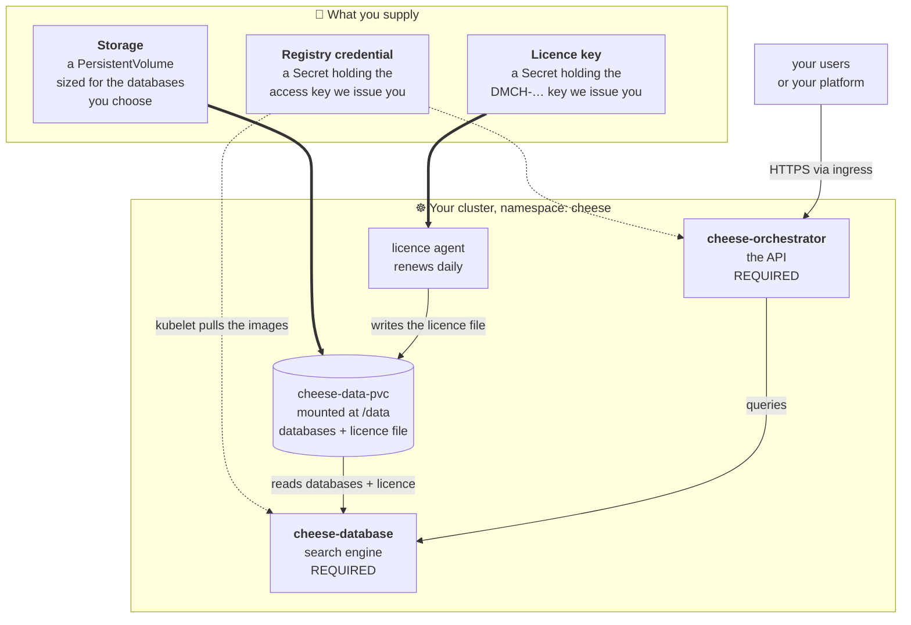

# cheese-k8s

A single Helm chart (`charts/cheese`) that brings up the whole on-prem CHEESE
stack from one `helm install`. Every component is toggled with a top-level
`.enabled` key in **one** `values.yaml` — there are no per-environment overlay
files. The environment (storage class + ingress class) is selected with
`deployment.target`.

## Basic setup <kbd>👤 start here</kbd>

The recommended deployment is two components: **`cheese-database`** (the search
engine) and **`cheese-orchestrator`** (the API you call). Together they are a
complete, working CHEESE — everything else in this chart is optional and off by
default, so a plain `helm install` gives you exactly this.

You supply three things. The chart supplies the rest.



### The three things you supply

| | What | Where it goes | Notes |
|---|---|---|---|
| 💾 | **Storage** | a PersistentVolume the chart binds as `cheese-data-pvc` at `/data` | Holds the databases *and* the licence file. Size it for the databases you pick — they run from under 1 GB to 1.3 TB each. Stage the contents owned by `2112:0`. Layout and staging commands: [docs/pvc-data-runbook.md](docs/pvc-data-runbook.md). |
| 🔑 | **Registry credential** | a Secret the kubelet uses to pull the images | One access key from DeepMedChem. It is read-only and its only right is pulling what you are licensed for. |
| 📄 | **Licence key** | a Secret the licence agent reads | A `DMCH-…` key. The agent exchanges it for a 30-day licence file, writes that to `/data`, and renews it daily — so the licence covers the whole cluster and nodes can come and go. |

### Licensing on Kubernetes is v1 only

CHEESE has two licensing schemes. On Kubernetes only one of them applies:

- **v1 — "call home"** (what you use): the agent renews a 30-day file daily and
  the licence authorises **the whole installation**, however many nodes it spans.
- **v0 — "air-gapped"**: a long-lived file bound to **one physical machine's
  hardware id**. It cannot work on a cluster whose nodes change, so it is offered
  only for single-host Docker Compose installs.

> **⚠️ Status, so nobody is misled.** **No released product image verifies a v1
> licence yet** — that port is open work in the four gated repos. Until it ships,
> a v1 key is issued but not enforced, and a v1 licence *file* handed to a current
> image will be rejected by its v0 verifier with a misleading
> "signature does not match". Talk to us before wiring licensing into a partner
> cluster.

### Install it

```bash
helm install cheese charts/cheese -n cheese --create-namespace \
  -f charts/cheese/values-secrets.yaml
```

No `--set *.enabled` flags needed — database and orchestrator are the defaults.
Add components later by turning them on (see [Profiles](#profiles)). Full
step-by-step, including the secrets, is in [Quick start](#quick-start) below.

---

## Components

| Component | Key | Default | Notes |
|---|---|---|---|
| **Database** (app / jobs-db / jobs-exec / download-exec / **file-server**) | `database.enabled` | **on, required** | search engine + result file server, all off one image |
| **Orchestrator** | `orchestrator.enabled` | **on, required** | the API you call |
| Search UI | `searchUi.enabled` | off | public frontend |
| SynthonGPT | `synthongpt.enabled` | off | synthon model server |
| **Ketcher** | `ketcher.enabled` | off | self-hosted molecule editor (UI iframes it) |
| **Inference** | `inference.enabled` | off | electrostatics; UI degrades gracefully if absent |
| **Alignment** | `alignment.enabled` | off | conformer alignment, license-gated |
| **Supabase** | `supabase.enabled` | off | in-cluster auth + per-user spaces (test profile) |
| **oauth2-proxy** | `oauth2Proxy.enabled` | off | SSO stub (alternate to Supabase) |
| **Licence agent** | `licenseAgent.enabled` | off | v1 licensing: renews the licence file onto `/data` daily ([docs](docs/licensing-agent.md)) |

## Deployment target

`deployment.target` selects storage + ingress class (see `templates/_platform.tpl`):

- **`local`** — kind / bare-metal dev. hostPath PV (`cheese-local-manual`) + `nginx`. Fully supported and tested.
- **`aws`** — **scaffold only** (no AWS sources/images yet): `gp3`/`efs-sc` + `alb` stubs, untested.
- **`azure`** — **deprecated / unsupported.**

An explicit `deployment.storage.className` / `deployment.ingress.className` always wins.

## Secrets

Each secret-producing component (`database`, `orchestrator`, `searchUi`, `supabase`,
`licenseAgent`) accepts `secret.existingSecret: <name>`:

- **Set it** → reference your own pre-created Secret (Vault / External Secrets
  Operator / SealedSecrets / `kubectl create secret`). The chart renders no inline
  Secret. Required keys per component are listed in `values-secrets.yaml.example`.
- **Leave it empty** → the chart renders the Secret inline from your values
  (self-contained / local path). See `values-secrets.yaml.example`.

## Quick start

Prerequisites: a Kubernetes cluster (≥ 1.28) with an ingress controller,
`kubectl`, `helm` ≥ 3.14. All commands run from this `k8s/` directory.

> **No cluster yet / just testing?** [`local-dev/`](local-dev/README.md) holds
> the internal kind test harness (throwaway cluster config, source-image
> build/sideload tooling). Nothing in it is needed for a real deployment.

```bash
# 1. Stage data on /data (license file, per-database dirs, SynthonGPT tree),
#    all chowned 2112:0. The chart creates the PV + PVC for you — no manual
#    kubectl apply. Layout + staging commands: docs/pvc-data-runbook.md.

# 2. Images — apply the registry pull secret; kubelet pulls
#    cheese.azurecr.io/on-prem/<svc>/cheese-customer:latest at install
#    (image.source: acr, the default):
cp manifests/base/image-pull-secret.example.yaml manifests/base/image-pull-secret.yaml
$EDITOR manifests/base/image-pull-secret.yaml      # fill in real registry creds
kubectl create namespace cheese
kubectl apply -f manifests/base/image-pull-secret.yaml

# 3. Fill in secrets and install with your profile
cp charts/cheese/values-secrets.yaml.example charts/cheese/values-secrets.yaml
$EDITOR charts/cheese/values-secrets.yaml
helm install cheese charts/cheese -n cheese --create-namespace \
  -f charts/cheese/values-secrets.yaml \
  -f local-profile.yaml          # see "Profiles" below (or use --set flags)

# 4. Wait for rollouts (SynthonGPT loads checkpoints — give it ~10m)
kubectl -n cheese get pods
```

With the local profile: UI → `http://cheese-ui.localtest.me`, orchestrator →
`http://cheese-api.localtest.me` (both resolve to `127.0.0.1` — swap in your
real hostnames via the ingress values for anything non-local).

## Profiles

The single `values.yaml` defaults are production-leaning (target=local but supabase
off, etc.). Layer a tiny profile file (or `--set` flags) for each environment.

**local / test** (`local-profile.yaml`) — in-cluster Supabase auth, local storage:

```yaml
deployment:
  target: local
supabase:
  enabled: true
  allowedEmailDomains: [deepmedchem.com]
orchestrator:
  supabase:
    enable: "true"
  env:
    enable_auth: "true"
ketcher:
  enabled: true
  ingress:                          # ketcher origin must be browser-reachable
    enabled: true
    hosts: [{ host: cheese-ketcher.localtest.me }]
```

**prod (aws scaffold)** (`prod-profile.yaml`) — external secrets, no in-cluster Supabase:

```yaml
deployment:
  target: aws                       # scaffold; storageClass/ingress are stubs until AWS images exist
  storage:
    accessMode: ReadWriteMany       # efs-sc — required to scale the search role across nodes
database:   { secret: { existingSecret: cheese-database } }
orchestrator: { secret: { existingSecret: cheese-orchestrator } }
searchUi:   { secret: { existingSecret: cheese-search-ui-secret } }
supabase:   { enabled: false }
inference:  { enabled: true }
alignment:  { enabled: true }
searchUi:
  config:
    FRONTEND_URL: https://cheese.example.com
    KETCHER_ORIGIN: https://ketcher.example.com
    SUPABASE_PUBLIC_URL: https://supabase.example.com
```

## Headless (API-only)

Set `searchUi.enabled: false` and turn auth off:

```yaml
searchUi:     { enabled: false }
ketcher:      { enabled: false }
orchestrator:
  supabase: { enable: "false" }
  env:      { enable_auth: "false" }
```

You get `cheese-database` + `cheese-synthongpt` + `cheese-orchestrator` behind the
`cheese-api.localtest.me` ingress, no UI/auth. Sanity-check:
`curl -sf http://cheese-api.localtest.me/health`.

## Generate license

The license is keyed to the host hardware of the node running the database
container, so keygen runs as a pod on that node:

```bash
kubectl run -n cheese cheese-license-keygen --rm -it --restart=Never \
  --image=cheese.azurecr.io/on-prem/cheese-database/cheese-customer:latest \
  --overrides='{"spec":{"imagePullSecrets":[{"name":"cheese-acr-pull"}]}}' \
  --command -- python -c 'from generate_license_ID import main; main()'
```

Send the key to support, then drop the returned JSON onto `/data` on the host:

```bash
cp cheese_license_file.json /data/cheese_license_file.json
chown 2112:0 /data/cheese_license_file.json
```

Set `database.secret.cheeseLicenseFile` and `orchestrator.secret.cheeseLicenseFile`
to that filename (they must match — one shared PVC). On kind the node is itself a
container and fakes the hardware identity — see
[`local-dev/README.md`](local-dev/README.md) for the extra steps.

## Licensing v1 — the licence agent

The section above is the **v0** procedure: a long-lived licence file bound to one
machine's hardware id. On a cluster that only works while the database pod stays
on the node the licence was cut for.

**v1** is the alternative: you are issued a `DMCH-…` **key** instead of a file,
and an optional chart component — the **licence agent** — exchanges it for a
signed 30-day licence file, writes that onto the shared `/data` PVC where the
product containers already look, and renews it daily. The fingerprint it
registers is the **cluster's `kube-system` namespace UID**, so one licence covers
the whole installation and nodes may come and go.

```yaml
licenseAgent:
  enabled: true                                  # off by default
  serverUrl: https://licensing.deepmedchem.com
  secret:
    existingSecret: cheese-license-key           # a Secret with a `licenseKey` key
    # licenseKey: "DMCH-…"                       # …or inline, for self-contained installs
```

It adds one Deployment (1 replica), a ServiceAccount, and a `Role` in
`kube-system` whose only right is `get` on the `kube-system` namespace object.
The agent runs as UID 2112, not root.

> **⚠️ This lands ahead of enforcement.** No released CHEESE image verifies a v1
> licence yet (the verifier PRs are still open), and a v1 file handed to a current
> image is rejected by its v0 verifier with a misleading "signature does not
> match". A `DMCH-PTN-…` **partner token is not a licence key.**

Full detail — the licensing model, one-licence-per-installation vs partner
sublicensing, the RBAC probe results, why the agent is not root, operating and
troubleshooting it: **[docs/licensing-agent.md](docs/licensing-agent.md)**.

## Verify the chart (no cluster)

```bash
helm lint charts/cheese
helm template cheese charts/cheese                                   # defaults
helm template cheese charts/cheese --set supabase.enabled=true \
  --set supabase.secret.postgresPassword=x --set supabase.secret.jwtSecret=x \
  --set supabase.secret.anonKey=x --set supabase.secret.serviceRoleKey=x
helm template cheese charts/cheese --set deployment.target=aws       # storage gp3 / ingress alb, no local PV
helm template cheese charts/cheese --set orchestrator.secret.existingSecret=my-sec
# licence agent: nothing may render by default, then inline key / external secret
helm template cheese charts/cheese | grep -c license-agent            # → 0
helm template cheese charts/cheese --set licenseAgent.enabled=true \
  --set licenseAgent.secret.licenseKey=DMCH-EXAMPLE
helm template cheese charts/cheese --set licenseAgent.enabled=true \
  --set licenseAgent.secret.existingSecret=cheese-license-key
```

## Repo layout

```
k8s/
├── charts/cheese/                  # ← the deliverable: everything a deployment needs
│   ├── Chart.yaml
│   ├── values.yaml                 # the one source of truth (all components + deployment.target)
│   ├── values-secrets.yaml.example # inline secrets / existingSecret contract
│   ├── files/supabase/             # vendored gateway.conf + SQL (db / schema / on-prem overlay)
│   └── templates/
│       ├── _helpers.tpl  _platform.tpl
│       ├── data-pvc.yaml  data-pv-local.yaml
│       ├── database-* orchestrator-* synthongpt-* search-ui-*
│       ├── ketcher-* inference-* alignment-*
│       ├── license-agent-*         # v1 licensing agent (deployment / rbac / secret), off by default
│       └── supabase/   # db / auth / rest / meta / studio / gateway / sql-configmap / init-job
├── docs/                           # pvc-data-runbook, architecture, headless-variant, licensing-agent
├── manifests/base/                 # namespace.yaml, image-pull-secret.example.yaml
└── local-dev/                      # internal kind test harness — NOT needed to deploy
    ├── Makefile  scripts/  kind/   # build-source-images, load-images, ingress-controller
    ├── env/                        # UI source-build Vite args
    └── docs/                       # install-order (kind playbook), kind-bringup-log
```

## Conventions

- **Image source.** Each app component accepts `image.source: local | acr`.
- **Shared PVC at `/data`.** database / orchestrator / synthongpt / alignment mount
  `cheese-data-pvc` (RWO by default; set `deployment.storage.accessMode: ReadWriteMany`
  on a cloud target to scale the search role across nodes). Supabase uses its own PVC.
- **UID 2112 group 0.** Pods touching `/data` run as that identity; stage files `chown -R 2112:0`.
- **Stable resource names.** `cheese-database-app`, `cheese-orchestrator`, `cheese-inference`,
  `cheese-alignment-app`, `cheese-ketcher`, `supabase-*` — so in-cluster service URLs work out of the box.

## Teardown

```bash
helm uninstall cheese -n cheese
kubectl -n cheese delete pvc -l app.kubernetes.io/name=cheese
kubectl delete pv cheese-data-pv
# The data itself lives on the node at /data — remove it there only if you
# really mean to destroy it. (kind clusters: see local-dev/README.md.)
```
