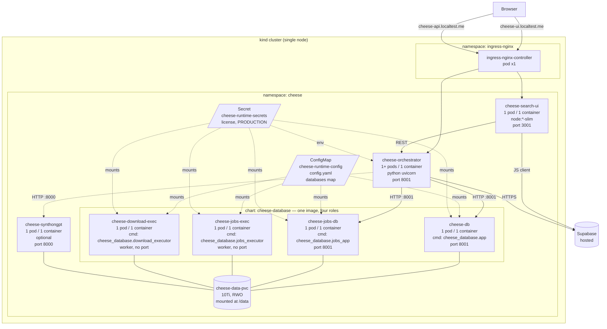

# cheese-k8s — Architecture

Pod-level view of the on-prem prototype running on a single-node `kind` cluster.

## Pod diagram



## Pod inventory

Minimal prototype: **7 pods** in two namespaces.

| Namespace       | Workload                  | Pods | Port  | Notes                                                       |
|-----------------|---------------------------|------|-------|-------------------------------------------------------------|
| `ingress-nginx` | `ingress-nginx-controller`| 1    | 80/443| Stock kind ingress controller                               |
| `cheese`        | `cheese-search-ui`        | 1    | 3001  | Node SSR + static                                           |
| `cheese`        | `cheese-orchestrator`     | 1+   | 8001  | FastAPI; talks to Supabase + db services                    |
| `cheese`        | `cheese-db`               | 1    | 8001  | `cheese_database.app`                                       |
| `cheese`        | `cheese-jobs-db`          | 1    | 8001  | `cheese_database.jobs_app`                                  |
| `cheese`        | `cheese-jobs-exec`        | 1    | —     | `cheese_database.jobs_executor` worker                      |
| `cheese`        | `cheese-download-exec`    | 1    | —     | `cheese_database.download_executor` worker                  |

With SynthonGPT enabled: **+1 pod** (`cheese-synthongpt`, port 8000).

## Notes

- The four database pods run from one image (`cheese-database`); only `command:` differs. Two roles expose Services (`cheese-db`, `cheese-jobs-db`); the two `*-exec` workers have no Service.
- All five data-plane pods (`cheese-db`, `cheese-jobs-db`, `cheese-jobs-exec`, `cheese-download-exec`, `cheese-synthongpt`) mount the single `cheese-data-pvc` at `/data`. `ReadWriteOnce` is fine on the prototype because every data-plane pod is pinned to the single kind node.
- **Supabase is the only external dependency.** No standalone Postgres, no Keycloak. The orchestrator's psycopg2 path is dead code in the active runtime; the chart's `POSTGRES_*` env block is a vestigial cleanup item, not a live dependency.
- Orchestrator reads SynthonGPT via `SYNTHONGPT_API_URL=http://cheese-synthongpt.cheese.svc.cluster.local:8000` (consumed by `cheese_orchestrator/cheese_core.py`).

## Chart shape (summary)

All four components are Helm charts under `charts/`. The non-obvious one is `cheese-database`: it's an extension of the upstream chart with two new top-level value blocks.

```yaml
roles:
  app:           { enabled: true, command: ["python","-um","cheese_database.app"],              port: 8001 }
  jobs-db:       { enabled: true, command: ["python","-um","cheese_database.jobs_app"],         port: 8001 }
  jobs-exec:     { enabled: true, command: ["python","-um","cheese_database.jobs_executor"]                }
  download-exec: { enabled: true, command: ["python","-um","cheese_database.download_executor"]            }

databases:
  test:
    path: /data/on-prem/databases/test_db
    delimiter: ","
    indexType: in_memory
    transformer: morgan_tanimoto

image:
  source: local              # local | acr
```

`databases:` is the values-driven hook for the recurring "add a real database" routine — bumping that map and `helm upgrade` is the established path; the actual data files land on the PVC out-of-band.

## Install order

1. `kind` cluster + ingress controller
2. Namespace + PVC + (optional) ACR pull secret
3. `cheese-database` (data plane up first; orchestrator polls it)
4. `cheese-synthongpt` (optional)
5. `cheese-orchestrator`
6. `cheese-search-ui`
